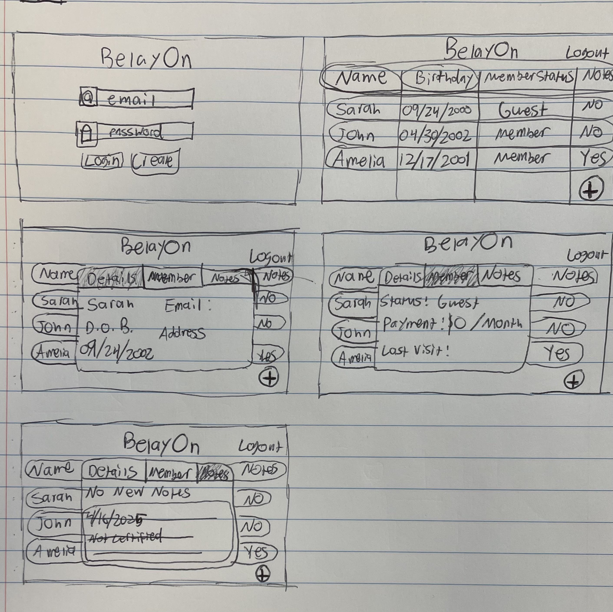
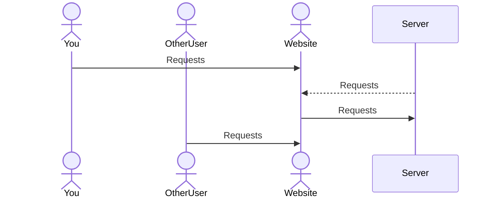

# BelayOn

[My Notes](notes.md)

An application to keep track of your gym's members to keep climbers climbing and staff moving.

## 🚀 Specification Deliverable

For this deliverable I did the following. I checked the box `[x]` and added a description for things I completed.

- [x] Proper use of Markdown
- [x] A concise and compelling elevator pitch
- [x] Description of key features
- [x] Description of how you will use each technology
- [x] One or more rough sketches of your application. Images must be embedded in this file using Markdown image references.

### Elevator pitch

As climbing moves to the forefront of sports, the demand for climbing gyms has increased dramatically. With more and more climbers moving indoors the systems of yesterday to track and manage guest and members are no longer adequet. BelayOn solves these problems by using modern web tools and techniques to help you manage your gym more effectively, allowing your climbers a seamless transition from guest to member. Improved productivity for your staff also allows them to focus more on customer relations, facilities managment, safety, and instruction overall improving the quality of life for everyone in the gym. 

### Design

First page will be a login page, allowing employees access to the system. Logging in will pull up the list of all guests and members with some information about each. Clicking on a name will pull up a small window with more detailed information and the ability to view their membership status and notes. All of these will have buttons and options to edit on the fly.

### Key features

- One-Click Member: Allow easy transition from Guest to Member in 1 click.
- Robust Notes: Ability to add notes to account and view deleted notes to keep staff aware of context with accounts.
- Linked Accounts: Families are easily accessed and modified together, rather than needing to edit each account separately.
- Checkout System: Prevent mix ups by making sure only 1 staff member can modify an account at a time.

### Technologies

I am going to use the required technologies in the following ways.

- **HTML** - Provide a structure to the website ensuring users can find what they need. Two pages, one for logging in and one for displaying the guests and members. A smaller popup window will be needed to display more info of the guests.
- **CSS** - By creating a smooth workflow through efficient and pleasing to look at site. Scaling on different screen sizes, using smoother edges and bright colors will allow for a modern sleek design.
- **React** - React will make the webpage interactable for users to login, make edits to accounts, show other users working on accounts, and showing the list of guests/members.
- **Service** - Allow users to access accounts from anywhere. Retrieves member's and guest's data, edits from the user to be saved, current editing from other users, logging in and signing up, and retreiving motivation quotes from [ZenQuotes](https://zenquotes.io?api=today)
- **DB/Login** - Ensure only certified users can make edits to the system and store guest and member accounts/details.
- **WebSocket** - Prevent users from editing the same account and overriding eachother's work. Shows which accounts are locked because other users are currently editing them.

## 🚀 AWS deliverable

For this deliverable I did the following. I checked the box `[x]` and added a description for things I completed.

- [ ] **Server deployed and accessible with custom domain name** - [My server link](https://yourdomainnamehere.click).

## 🚀 HTML deliverable

For this deliverable I did the following. I checked the box `[x]` and added a description for things I completed.

- [ ] **HTML pages** - I did not complete this part of the deliverable.
- [ ] **Proper HTML element usage** - I did not complete this part of the deliverable.
- [ ] **Links** - I did not complete this part of the deliverable.
- [ ] **Text** - I did not complete this part of the deliverable.
- [ ] **3rd party API placeholder** - I did not complete this part of the deliverable.
- [ ] **Images** - I did not complete this part of the deliverable.
- [ ] **Login placeholder** - I did not complete this part of the deliverable.
- [ ] **DB data placeholder** - I did not complete this part of the deliverable.
- [ ] **WebSocket placeholder** - I did not complete this part of the deliverable.

## 🚀 CSS deliverable

For this deliverable I did the following. I checked the box `[x]` and added a description for things I completed.

- [ ] **Visually appealing colors and layout. No overflowing elements.** - I did not complete this part of the deliverable.
- [ ] **Use of a CSS framework** - I did not complete this part of the deliverable.
- [ ] **All visual elements styled using CSS** - I did not complete this part of the deliverable.
- [ ] **Responsive to window resizing using flexbox and/or grid display** - I did not complete this part of the deliverable.
- [ ] **Use of a imported font** - I did not complete this part of the deliverable.
- [ ] **Use of different types of selectors including element, class, ID, and pseudo selectors** - I did not complete this part of the deliverable.

## 🚀 React part 1: Routing deliverable

For this deliverable I did the following. I checked the box `[x]` and added a description for things I completed.

- [ ] **Bundled using Vite** - I did not complete this part of the deliverable.
- [ ] **Components** - I did not complete this part of the deliverable.
- [ ] **Router** - I did not complete this part of the deliverable.

## 🚀 React part 2: Reactivity deliverable

For this deliverable I did the following. I checked the box `[x]` and added a description for things I completed.

- [ ] **All functionality implemented or mocked out** - I did not complete this part of the deliverable.
- [ ] **Hooks** - I did not complete this part of the deliverable.

## 🚀 Service deliverable

For this deliverable I did the following. I checked the box `[x]` and added a description for things I completed.

- [ ] **Node.js/Express HTTP service** - I did not complete this part of the deliverable.
- [ ] **Static middleware for frontend** - I did not complete this part of the deliverable.
- [ ] **Calls to third party endpoints** - I did not complete this part of the deliverable.
- [ ] **Backend service endpoints** - I did not complete this part of the deliverable.
- [ ] **Frontend calls service endpoints** - I did not complete this part of the deliverable.
- [ ] **Supports registration, login, logout, and restricted endpoint** - I did not complete this part of the deliverable.

## 🚀 DB deliverable

For this deliverable I did the following. I checked the box `[x]` and added a description for things I completed.

- [ ] **Stores data in MongoDB** - I did not complete this part of the deliverable.
- [ ] **Stores credentials in MongoDB** - I did not complete this part of the deliverable.

## 🚀 WebSocket deliverable

For this deliverable I did the following. I checked the box `[x]` and added a description for things I completed.

- [ ] **Backend listens for WebSocket connection** - I did not complete this part of the deliverable.
- [ ] **Frontend makes WebSocket connection** - I did not complete this part of the deliverable.
- [ ] **Data sent over WebSocket connection** - I did not complete this part of the deliverable.
- [ ] **WebSocket data displayed** - I did not complete this part of the deliverable.
- [ ] **Application is fully functional** - I did not complete this part of the deliverable.
